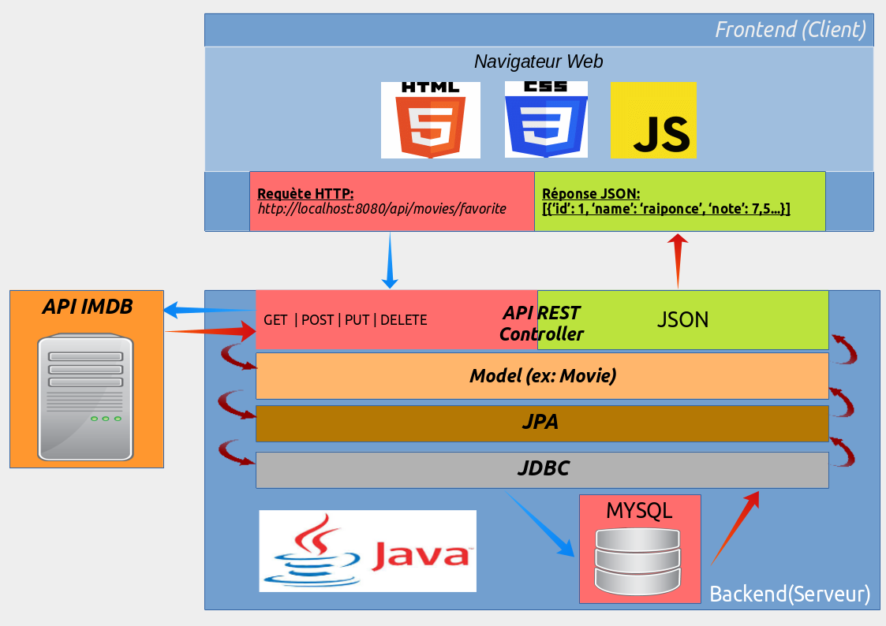
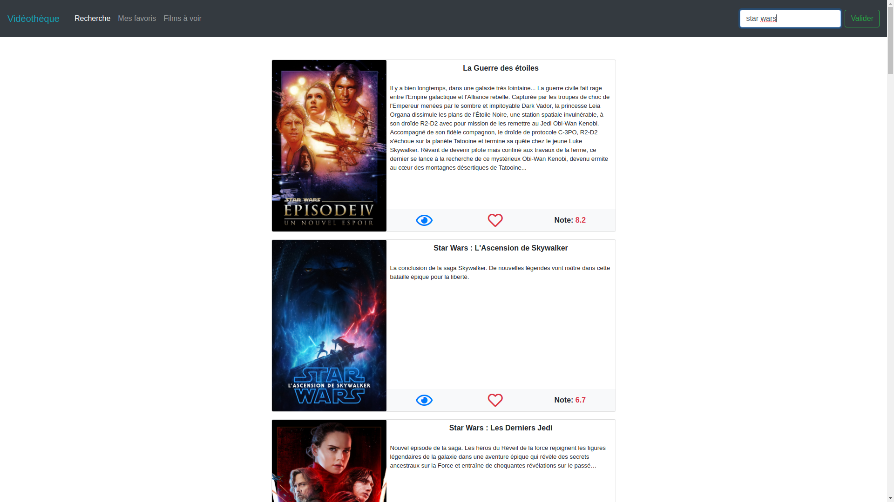

# <center>Vidéothèque</center>

## L'application

C'est un simple site web qui propose à un utilisateur de rechecher un film et de l'ajouter soit dans ses favoris, soit dans une liste de films à voir.Les listes de films contiennent l'affiche du film, son résumé, sa note sur IMDB, ainsi que des icones définissant le statut du film pour l'utilisateur: favoris et/ou à voir.
La barre de navigation contient trois liens:

- __*Recherche*__ affiche le résultat de la recherche.
- __*Mes favoris*__ affiche la liste des films ajoutés aux favoris.
- __*Films à voir*__ affiche la liste des films que l'utilisateur souhaite voir.  

--- 

## Arhchitecture


---

## API

Le backend propose plusieurs __endpoints__ remplissant le contrat __CRUD__:

*CREATE*

- ```/api/movies/add```

```
HTTP/1.0 201 OK
Content-Type: application/json
{
    responseText: "film ajouté aux favoris"
}
```

*READ*

- ```/api/movies/find```
- ```/api/movies/favorite/all```
- ```/api/movies/wanted/all```

```
HTTP/1.0 200 OK
Content-Type: application/json
[
    {
        "id": 125,
        "title": "Les misérables",
        "overview": "C'est l'histoire de ...",
        "imageUrl": "https://tmdb.org/miserables.jpg"
        "note": 7,5,
        "favorite": true,
        "wanted": false
    },
    {
        "id": 152,
        "title": "Les envahisseurs",
        "overview": "C'est l'histoire de...",
        "imageUrl": "https://tmdb.org/envahisseurs.jpg"
        "note": 6,8
        "favorite": false,
        "wanted": false
    }
]

```
*UPDATE*

- ```/api/movies/update```
```
HTTP/1.0 201 OK
Content-Type: application/json
{
    responseText: "Film retiré des favoris"
}

```

*DELETE*

- ```/api/movies/delete```
```
HTTP/1.0 201 OK
Content-Type: application/json
{
    responseText: "Film supprimé de vos listes"
}
```
---

## Aperçu d'une recherche



---